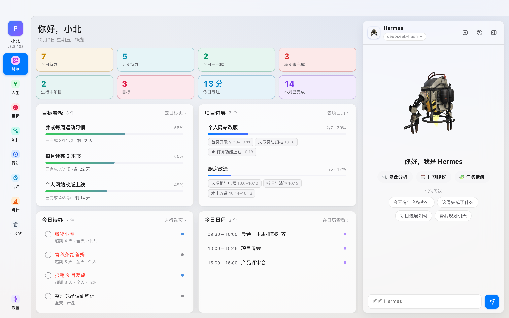

# 工作台 · 主页

> 一款 macOS 原生个人工作台的**产品介绍主页** —— 日程 · 待办 · 目标 · 项目 · 人生时间轴 · 专注 · 统计 + AI 助手。

[](https://github.com/Dawnst/workbench/releases/latest)



## 下载 App

**[→ 前往 Releases 下载最新版](https://github.com/Dawnst/workbench/releases/latest)**（Apple Silicon · macOS 12+）。
首次打开被 macOS 拦截属正常现象（未付费签名）：系统设置 → 隐私与安全性 → 「仍要打开」。

## 这是什么

「工作台」是一款跑在 Mac 上的原生个人效率应用（App 本体不在本仓库），本仓库是它的介绍主页，内容全部对齐 App 实际功能：

- **七大页面全景** —— 总览 / 行动 / 项目 / 目标 / 人生 / 专注 / 统计，每页配运行实景截图
- **AI 助手** —— 基于真实数据上下文作答，三种智能体（Hermes / Muse / Sage），长期记忆
- **三明治架构** —— Swift 原生壳 × 零构建 Web 前端 × Python 纯标准库本机服务
- **工程特点** —— 本地优先、零三方依赖、自动备份、原生通知、回收站软删

## 浏览

| 方式 | 说明 |
|---|---|
| 直接打开 | 双击 `index.html`（零外部请求，离线可看） |
| GitHub Pages | 仓库 Settings → Pages → 选 `main` 分支 `/ (root)`，稍后访问 `https://<用户名>.github.io/<仓库名>/` |

## 目录结构

```
工作台主页/
├── index.html      # 主页（样式/脚本全内联）
├── assets/         # 实景截图（Playwright @2x PNG）
├── tools/
│   └── capture.py  # 截图脚本（App 更新后重截）
└── docs/           # PRD / UI 方案 / 技术路线
```

## 文档

- [PRD](docs/PRD.md) —— 需求与内容口径
- [UI 方案](docs/UI方案.md) —— 视觉与交互设计
- [技术路线](docs/技术路线.md) —— 选型与实现要点

## 重截截图

App 大版本更新后，在仓库根目录执行：

```bash
# 1. 生成虚构演示数据库（输出 /tmp/wbdemo，人设「小北」，绝不含真实数据）
python3 tools/make_demo_data.py

# 2. 起一次性演示实例（8392，PWB_ORPHAN_OK 免看门狗）
cd <P-工作台3 项目根>
PWB_ORPHAN_OK=1 python3 server/server.py --port=8392 --data-dir=/tmp/wbdemo --web-dir=web &

# 3. 截图（默认连 8392，输出 assets/）
cd - && python3 tools/capture.py
```

---

内容口径基准：工作台 **v3.8.108** · 2026-10。
截图中的用户「小北」及全部待办 / 项目 / 目标 / 纪念日 / AI 对话均为**虚构演示数据**，不包含任何真实个人信息。
